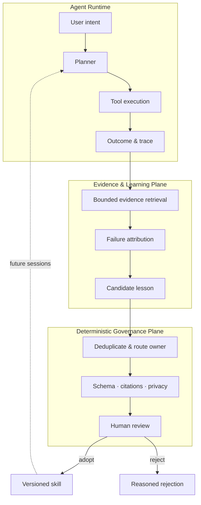
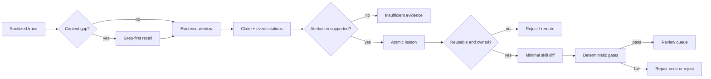
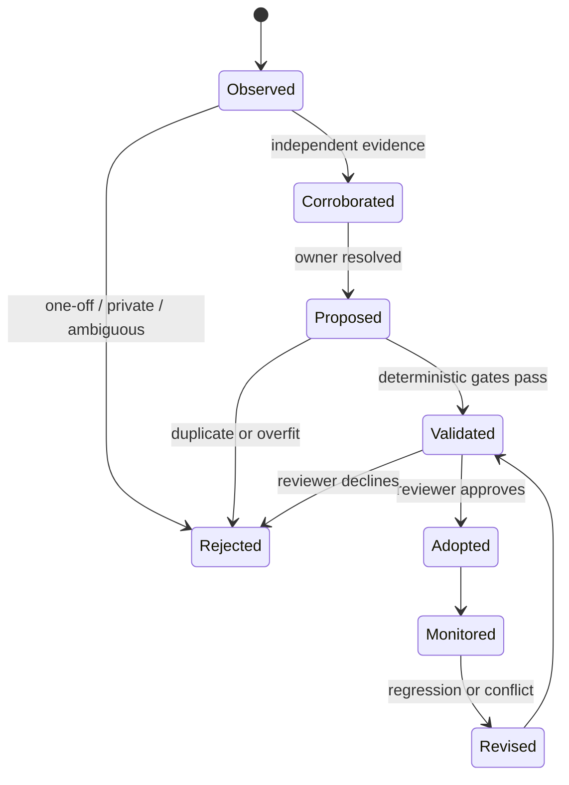
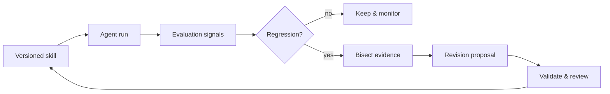

# Agent Self-Evolution

> Evidence-grounded, review-first skill evolution for long-running AI agents.

[简体中文](./README.zh-CN.md) · [Architecture](./docs/architecture.md) · [Worked example](./docs/worked-example.md) · [Evaluation](./docs/evaluation.md)

Long-horizon agents produce noisy traces: user corrections, partial plans, tool failures, retries, and successful recoveries. This project explores how to turn that history into reusable guidance **without giving a model unchecked authority to rewrite its own behavior**.

> A trace is not knowledge. A recurring, attributable, validated lesson may become a skill proposal.

## Innovation focus

### 1. Evidence-addressable learning

Every diagnosis cites a bounded set of sanitized trace events. Retrieval is grep-first and recent-first, so the system can explain **which evidence changed the rule** instead of hiding reasoning inside a summary.

### 2. Dual-plane evolution

Probabilistic components retrieve, attribute, and propose. Deterministic components enforce schema, citation, ownership, privacy, and diff constraints. This separates semantic judgment from write authority.

### 3. Reversible knowledge delivery

Learning produces a minimal, versioned proposal—not an immediate mutation. Each candidate has an owner, validation receipt, rejection reason, review decision, and post-adoption regression path.

## System at a glance



## Why naive self-learning fails

| Risk | Naive behavior | Governed alternative |
| --- | --- | --- |
| False causality | Blame the nearest visible event | Require cited evidence and controlled comparison |
| Over-generalization | Turn one workaround into a universal rule | Preserve condition → failure → action |
| Knowledge duplication | Append similar guidance everywhere | Resolve one existing owner before editing |
| Unsafe mutation | Rewrite instructions immediately | Produce a reviewable, reversible diff |
| Privacy leakage | Learn from raw payloads | Sanitize before retrieval and proposal |

## End-to-end pipeline



### Stage contracts

| Stage | Input | Output | Must not do |
| --- | --- | --- | --- |
| Retrieval | Sanitized event index | Bounded evidence window | Load unlimited history |
| Attribution | Evidence window | Claim with event citations | Infer missing evidence |
| Extraction | Supported claim | One conditional lesson | Copy scenario-specific details |
| Proposal | Lesson + owner | Minimal reviewable diff | Edit unrelated assets |
| Validation | Proposal + policies | Pass/fail receipt | Rely on model confidence |
| Review | Diff + receipt | Adopt/reject decision | Silently mutate behavior |

## Proposal lifecycle



## Evidence contract

```text
candidate_id      stable identifier
trigger           condition under which the lesson applies
failure_mode      observable failure, not guessed intention
evidence_refs     sanitized event IDs or reproducible checks
proposed_rule     smallest actionable guidance
owner             existing skill or policy that should contain it
strength          evidence strength, not model certainty
validation        deterministic checks and final receipt
```

Strong rules usually follow **condition → failure mode → diagnostic/corrective action**.

## Feedback and regression loop



Adoption is not the end. A rule remains useful only while later evidence supports it.

## Synthetic case

A fictional coding agent searches the wrong directory after a workspace switch. The public example stores neither the repository name nor the raw conversation. It extracts one bounded rule:

> When the active workspace may have changed, verify the current project root before running a repository-wide search.

The proposal cites sanitized events, routes the lesson to an existing owner, passes duplication and privacy gates, and then waits for review. Read the complete [worked example](./docs/worked-example.md).

## How it is evaluated

- **Evidence precision:** cited events support the claim
- **Attribution quality:** the cause explains the observed failure
- **Edit minimality:** only necessary guidance changes
- **Policy compliance:** ownership, privacy, and schema gates pass
- **Behavioral value:** replay improves the target behavior
- **Regression safety:** unrelated behavior stays stable

See the [evaluation framework](./docs/evaluation.md) for a practical rubric.

## Repository map

```text
README.md / README.zh-CN.md        project overview
docs/architecture.md               component and trust boundaries
docs/worked-example.md             end-to-end synthetic case
docs/evaluation.md                 quality rubric and regression gates
docs/grep-first-memory-retrieval.* bounded evidence recall
docs/public-disclosure.md          publication boundary
```

## Scope

This is an independently written, documentation-only system-design case study. It contains no employer implementation, production trace, private prompt, credential, internal identifier, or confidential metric.

## License

Documentation: CC BY-NC-ND 4.0. Employer and third-party rights are reserved.
