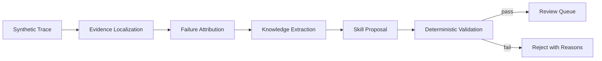

# Agent Self-Evolution

> A sanitized design case study for learning reusable skills from long-horizon agent traces.

[中文说明](./README.zh-CN.md)

This documentation describes an auditable pipeline that turns synthetic agent traces into reviewable skill proposals. It contains no implementation code, employer code, internal data, production prompts, or confidential metrics.



## Why this project

Long-running agents accumulate noisy observations, tool outputs, retries, and partial decisions. Updating a reusable skill directly from that raw history is risky. This project separates evidence, diagnosis, proposal, and validation so every change can be inspected before adoption.

## Design principles

- Evidence before conclusions: every diagnosis points to trace event IDs.
- Proposals, not silent mutation: generated skills enter a review queue.
- Deterministic gates: schemas, citations, and safety rules are validated without an LLM.
- Reproducible demos: examples use synthetic traces only.

## Repository map

```text
README.md
README.zh-CN.md
docs/
  architecture.md
  public-disclosure.md
```

## Scope

This is an independently written educational design document. It focuses on system boundaries and auditability rather than reproducing any proprietary system. Implementation code is intentionally private.

## Roadmap

- Define an evaluation rubric for attribution quality
- Document reviewable skill-diff semantics
- Explore sandboxed replay as a pre-adoption gate
- Add public-paper and documentation references

## License

Documentation: CC BY-NC-ND 4.0. Employer and third-party rights are reserved.
