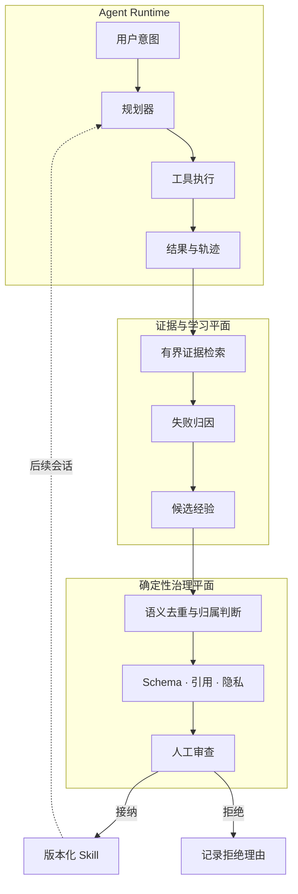
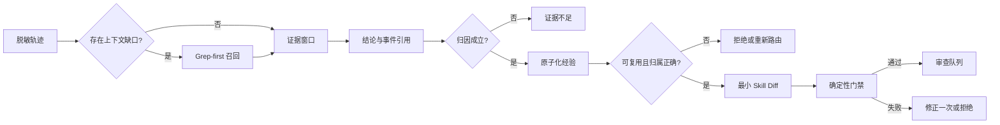
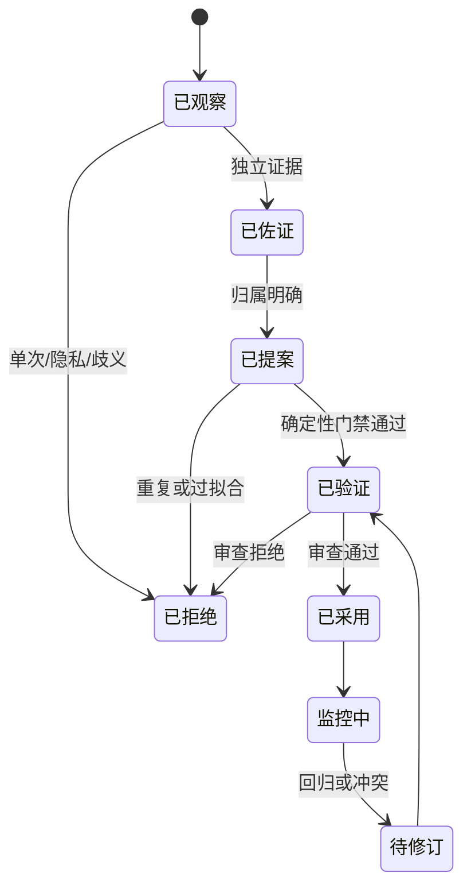
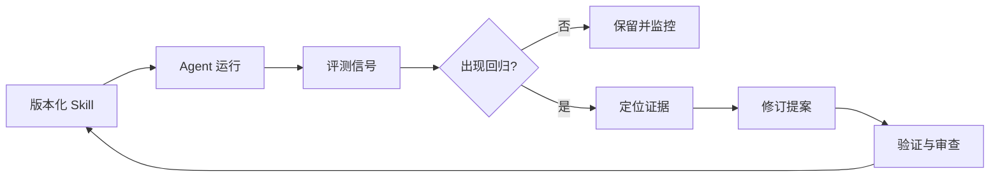

# Agent Self-Evolution

> 面向长程 AI Agent 的证据驱动、审查优先 Skill 演化设计。

[English](./README.md) · [架构](./docs/architecture.md) · [合成案例](./docs/worked-example.md) · [评测框架](./docs/evaluation.md)

长会话会产生用户纠正、局部计划、工具失败、重试与成功恢复等嘈杂轨迹。本项目讨论如何把这些历史转化为可复用指导，同时避免模型不受控制地改写自己的未来行为。

> 轨迹不等于知识。只有反复出现、可以归因并通过验证的经验，才有资格成为 Skill 提案。

## 创新焦点

### 1. 可寻址证据学习

每条诊断都引用一个有界的脱敏事件窗口。检索采用 grep-first、近期优先策略，使审查者能够回答“究竟是哪段证据改变了规则”。

### 2. 双平面演化

概率组件负责检索、归因与提案；确定性组件负责 Schema、引用、归属、隐私与 Diff 门禁。语义判断与写入权限由此分离。

### 3. 可回滚的知识交付

学习结果是最小、版本化提案，而不是即时修改。每个候选项都有唯一归属、验证回执、拒绝原因、审查决策和采用后的回归路径。

## 系统全景

## 为什么朴素自学习会失败

| 风险 | 朴素做法 | 受治理的替代方案 |
| --- | --- | --- |
| 错误因果 | 归因于最近出现的事件 | 要求证据引用与受控对照 |
| 过度泛化 | 把一次补丁写成通用规则 | 保留条件 → 故障 → 动作 |
| 知识重复 | 在多个位置追加相似规则 | 编辑前确定唯一现有归属 |
| 不安全变更 | 直接改写指令 | 生成可审查、可回滚 Diff |
| 隐私泄漏 | 从原始载荷学习 | 在检索和提案前完成脱敏 |

## 端到端流程

## 阶段契约

| 阶段 | 输入 | 输出 | 禁止行为 |
| --- | --- | --- | --- |
| 检索 | 脱敏事件索引 | 有界证据窗口 | 无限制加载历史 |
| 归因 | 证据窗口 | 带事件引用的结论 | 补写不存在的证据 |
| 提炼 | 已支持结论 | 一条条件化经验 | 复制场景专属细节 |
| 提案 | 经验与目标归属 | 最小可审查 Diff | 修改无关资产 |
| 验证 | 提案与策略 | 通过/失败回执 | 依赖模型自信度 |
| 审查 | Diff 与回执 | 接纳/拒绝决策 | 静默修改行为 |

## 提案生命周期

## 证据契约

候选项至少包含：稳定 ID、触发条件、可观测故障、脱敏证据引用、最小规则、唯一归属、证据强度和确定性校验结果。

优先使用 **条件 → 故障 → 诊断/修正动作**，而不是无条件的“必须/禁止”。

## 反馈与回归闭环

## 合成案例

一个虚构 Coding Agent 在切换工作区后搜索了错误目录。公开案例不保留仓库名和原始对话，只提炼出：

> 当活动工作区可能发生变化时，应在全仓检索前确认当前项目根目录。

提案引用脱敏事件，路由到现有归属，完成去重与隐私校验后进入人工审查。详见[合成案例](./docs/worked-example.md)。

## 如何评测

- **证据精度**：引用是否真正支持结论
- **归因质量**：原因是否解释可观测故障
- **编辑最小性**：是否只修改必要内容
- **策略合规**：归属、隐私、Schema 是否通过
- **行为价值**：回放是否改善目标行为
- **回归安全**：无关能力是否保持稳定

## 文档导航

- [组件边界与数据流](./docs/architecture.md)
- [端到端合成案例](./docs/worked-example.md)
- [质量量表与回归门禁](./docs/evaluation.md)
- [Grep-first 长程证据召回](./docs/grep-first-memory-retrieval.zh-CN.md)
- [公开边界](./docs/public-disclosure.md)

## 公开范围

本仓库是独立编写的纯文档系统设计案例，不包含雇主实现、生产轨迹、私有 Prompt、凭据、内部标识或保密指标。

## 许可

文档采用 CC BY-NC-ND 4.0；雇主和第三方权利均予以保留。
