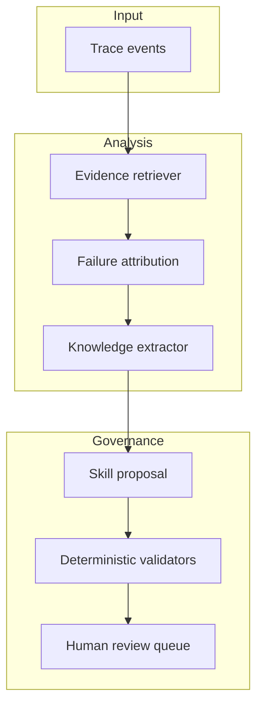

# Architecture

The reference pipeline deliberately keeps probabilistic and deterministic responsibilities separate.

Any future implementation should preserve event citations and keep model-backed components behind the same deterministic validation boundary. Implementation details remain private.
