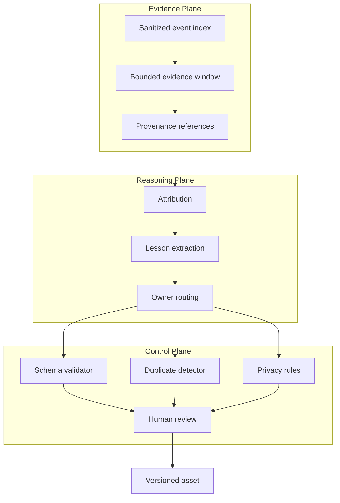
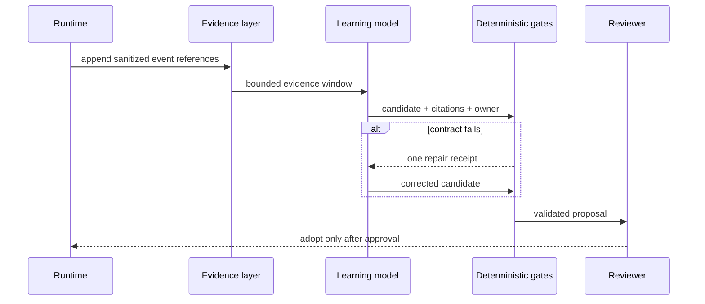

# Architecture and Trust Boundaries

The architecture separates runtime evidence, semantic reasoning, and deterministic governance. This prevents a probabilistic component from acquiring unchecked write authority.

## Component model

## Trust matrix

| Component | Trusted for | Not trusted for |
| --- | --- | --- |
| Raw runtime trace | Local investigation | Direct publication or durable memory |
| Sanitized evidence | Supporting a bounded claim | Proving causality by itself |
| Model diagnosis | Generating hypotheses | Final admission or write authority |
| Deterministic validator | Contract and policy checks | Semantic usefulness |
| Human reviewer | Adoption decision | Replacing regression evidence |

## Failure containment

## Architectural invariants

1. Every semantic claim has provenance.
2. Every candidate receives exactly one decision.
3. Every accepted edit has one existing owner.
4. No probabilistic component can publish directly.
5. Validation receipts are derived from final proposed text.
6. Private context is unnecessary for understanding a public rule.

## Data minimization

The public model needs event types, causal relationships, and validation outcomes—not identities, payloads, repository names, endpoints, or operational thresholds. Sanitization happens before learning, not after a proposal is written.
