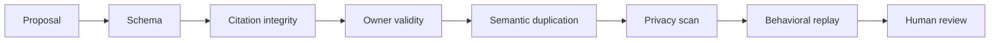

# Evaluation Framework

Evaluation tests whether a proposal improves target behavior without corrupting unrelated guidance.

## Review rubric

| Dimension | 0 | 1 | 2 |
| --- | --- | --- | --- |
| Evidence support | No relevant citation | Partial support | Direct, sufficient support |
| Attribution | Speculative | Plausible | Controlled retry or corroboration |
| Generalization | One-off detail | Some reusable structure | Clear condition and reusable action |
| Ownership | Missing/conflicting | Broad owner | Narrow existing owner |
| Minimality | Broad rewrite | Some unrelated change | Atomic diff |
| Safety | Private or unverifiable | Needs manual cleanup | Public-safe and reviewable |

Safety and evidence support should normally score 2 before a proposal enters review.

## Gate sequence

## Regression suite

- Positive case: target behavior improves under the stated condition
- Negative case: the rule does not fire outside its condition
- Conflict case: existing guidance remains consistent
- Privacy case: no source-specific identifier survives
- Reversibility case: the update can be removed without damaging unrelated assets

## Useful metrics

- acceptance rate by candidate category
- rejection reasons by category
- citation precision sampled by reviewers
- replay pass rate before and after adoption
- post-adoption rollback rate
- duplicate guidance rate across skills

A high acceptance rate alone can indicate weak governance rather than strong learning.
