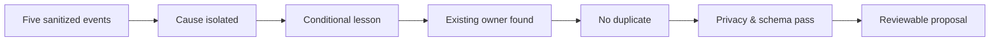

# Worked Example: Workspace Switch

This fictional example demonstrates the contracts without using a real conversation or repository.

## Scenario

A coding agent finishes work in workspace A. The user asks it to continue a similar task in workspace B. The agent searches before verifying the active root, finds no matching files, and incorrectly concludes that the feature does not exist.

## Sanitized trace

| Event | Type | Observation |
| --- | --- | --- |
| `e-01` | context | Workspace may have changed |
| `e-02` | action | Repository-wide search executed |
| `e-03` | result | No matches returned |
| `e-04` | correction | Active root differs from assumed root |
| `e-05` | retry | Search in verified root returns relevant files |

## Attribution

**Claim:** the false negative came from an unverified workspace assumption, not from the search expression.

**Support:** `e-01`, `e-02`, `e-04`, and the successful controlled retry in `e-05`.

## Candidate lesson

> When the active workspace may have changed, verify the current project root before running a repository-wide search.

## Admission path

## Counterexample

If the root was already verified and the failure came from an incorrect regular expression, this rule would not apply. Preserving that boundary prevents over-generalization.
